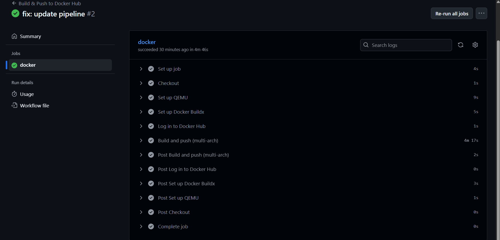

Santiago Arboleda Velasco
A00369824

# docker-test — Informe de trabajo realizado

Este documento describe **lo que implementé** para contenedorización y CI/CD de la aplicación Create React App del repositorio `docker-test`. El objetivo fue construir una imagen Docker de producción y **publicarla automáticamente en Docker Hub** mediante GitHub Actions cada vez que se haga `push` al repositorio.

## Resumen ejecutivo

- **Repositorio original:** `ChristianFlor/docker-test` (forkeado).
- **Mi fork:** `https://github.com/Santi1761/docker-test`
- **Usuario Docker Hub:** `santi1761`
- **Repositorio de imagen:** `docker-test`
- **Nombre completo de la imagen:** `santi1761/docker-test`
- **Estrategia de publicación:** al hacer `push` a cualquier rama se construye y publica una imagen con las tags `latest` (si aplica) y el `SHA` del commit.

---

## Alcance y objetivos

- Contenerizar la app CRA con buenas prácticas de producción (build separado y servidor estático).
- Configurar un pipeline CI/CD en GitHub Actions que:
  1. Haga checkout del código.
  2. Prepare `buildx` para construir imágenes multi-arquitectura.
  3. Inicie sesión en Docker Hub utilizando **secrets**.
  4. Construya y **publique** la imagen en `santi1761/docker-test`.

---

## Decisiones técnicas

- **Docker multi-stage:** usé un **primer stage** con `node:18-alpine` para compilar el front (CRA) y un **segundo stage** con `nginx:alpine` para servir el contenido estático de `build/`.
- **Enrutamiento SPA:** agregué `nginx.conf` con `try_files $uri /index.html;` para soportar refresh y rutas internas del SPA.
- **.dockerignore:** excluí `node_modules`, `build`, metadatos de git y logs para acelerar los builds y reducir el contexto.
- **Build multi-arquitectura:** habilité `linux/amd64,linux/arm64` con `docker/setup-qemu-action` + `docker/setup-buildx-action`.
- **Etiquetado de imágenes:** publiqué dos tags por build: `latest` y `SHA` del commit (`${{ github.sha }}`).

---

## Estructura agregada al repositorio

```
.
├── Dockerfile            # Build CRA y stage de Nginx
├── nginx.conf            # Config para SPA (try_files)
├── .dockerignore         # Exclusiones de build
└── .github/
    └── workflows/
        └── docker.yml    # Pipeline de GitHub Actions
```

---

## Configuración de credenciales (secrets)

Este es mi Fork:


Creé dos **Repository secrets** en GitHub (Settings → Secrets and variables → Actions):

- `DOCKERHUB_USERNAME` = `santi1761`
- `DOCKERHUB_TOKEN` = `<access token generado en Docker Hub>`

> El token se generó en Docker Hub (Account Settings → Security → New Access Token).


---

## Pipeline de CI/CD (GitHub Actions)

**Archivo:** `.github/workflows/docker.yml`  
**Disparadores (triggers):**
- `push` a cualquier rama.
- `workflow_dispatch` para ejecución manual.

**Pasos ejecutados:**
1. `actions/checkout@v4` — Descarga el código de la rama.
2. `docker/setup-qemu-action@v3` — Soporte multi-arquitectura.
3. `docker/setup-buildx-action@v3` — Builder `buildx`.
4. `docker/login-action@v3` — Login a Docker Hub con secrets.
5. `docker/build-push-action@v6` — Build y push de la imagen con dos tags: `latest` y `${{ github.sha }}`.

**Tags publicadas:**
- `santi1761/docker-test:latest`
- `santi1761/docker-test:<SHA>`

---

## Resultado y evidencias

- **Ejecución del workflow en Actions:** `https://github.com/Santi1761/docker-test/actions/runs/17899449689/job/50890478593`  
  
- **Repositorio en Docker Hub:** `https://hub.docker.com/r/santi1761/docker-test`  
  
- **Imagen ejecutando localmente:**

  ```bash
  docker pull santi1761/docker-test:latest
  docker run -p 8080:80 --name docker-test santi1761/docker-test:latest
  # Abrir http://localhost:8080
  ```
 
  - 
  -   
  -   

---

## Incidencias y cómo las resolví

- **Rendimiento del build:** añadí `.dockerignore` para reducir el contexto y evitar subir `node_modules` y `build`.


## Contenido exacto de los archivos creados

**`.dockerignore`**
```
node_modules
build
.git
.gitignore
Dockerfile
.dockerignore
npm-debug.log*
yarn-error.log*
```

**`nginx.conf`**
```nginx
server {
  listen 80;
  server_name _;

  root /usr/share/nginx/html;
  index index.html;

  location / {
    try_files $uri /index.html;
  }

  location /static/ {
    access_log off;
    expires 1y;
    add_header Cache-Control "public";
    try_files $uri =404;
  }
}
```

**`Dockerfile`**
```dockerfile
# -------- Stage 1: build (Create React App) --------
FROM node:18-alpine AS builder
WORKDIR /app

# Instala dependencias
COPY package*.json ./
RUN npm install --no-audit --no-fund

# Copia el resto y construye
COPY . .
RUN npm run build

# -------- Stage 2: servir con Nginx --------
FROM nginx:alpine

# Config SPA (rutas) y estáticos
COPY nginx.conf /etc/nginx/conf.d/default.conf

# Copia el build de CRA
COPY --from=builder /app/build /usr/share/nginx/html

EXPOSE 80
CMD ["nginx", "-g", "daemon off;"]
```

**`.github/workflows/docker.yml`**
```yaml
name: Build & Push to Docker Hub

on:
  push:
    branches: ["**"]
  workflow_dispatch:

jobs:
  docker:
    runs-on: ubuntu-latest

    steps:
      - name: Checkout
        uses: actions/checkout@v4

      - name: Set up QEMU
        uses: docker/setup-qemu-action@v3

      - name: Set up Docker Buildx
        uses: docker/setup-buildx-action@v3

      - name: Log in to Docker Hub
        uses: docker/login-action@v3
        with:
          username: ${{ secrets.DOCKERHUB_USERNAME }}
          password: ${{ secrets.DOCKERHUB_TOKEN }}

      - name: Build and push (multi-arch)
        uses: docker/build-push-action@v6
        with:
          context: .
          push: true
          platforms: linux/amd64,linux/arm64
          tags: |
            santi1761/docker-test:latest
            santi1761/docker-test:${{ github.sha }}
```


